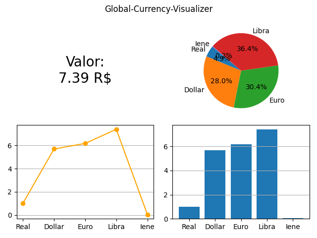

# Global-Currency-Viewer
### Sobre o projeto

O **Global-Currency-Visualizer** é uma ferramenta visual e simples que permite monitorar em tempo real as cotações de algumas das principais moedas globais em relação ao real brasileiro (BRL). Utilizando web scraping, o programa coleta as cotações do Dólar (USD), Euro (EUR), Libra (GBP) e Iene (JPY) diretamente do Google e exibe esses dados graficamente.

### Resultado

